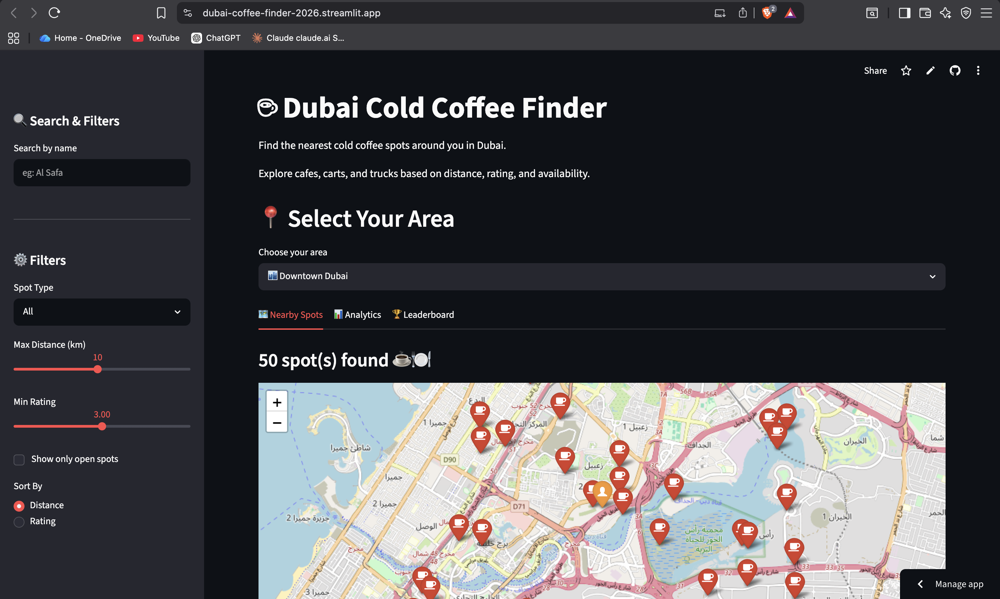
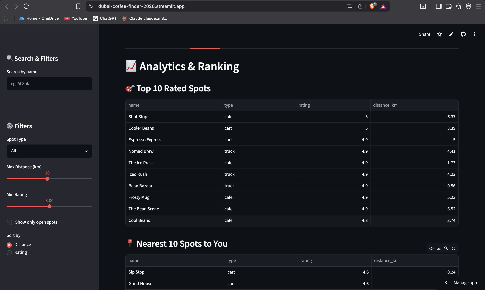
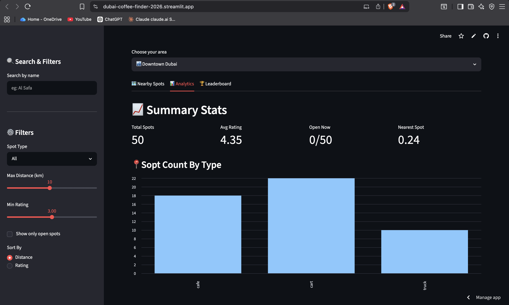
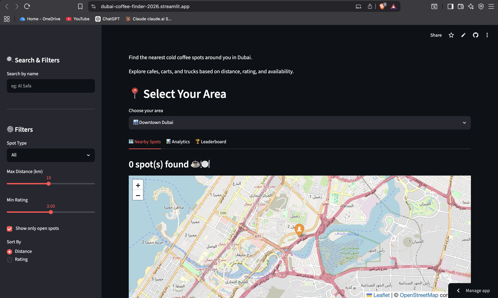

# ☕ Dubai Cold Coffee Finder
### Discover the Best Cold Coffee Cafés in Dubai with Smart Location-Based Recommendations


A **Streamlit-based recommendation system** that helps users discover the best cold coffee cafés and restaurants in Dubai using **distance, ratings, price, and availability (Open/Closed)**. The application simplifies café discovery by providing personalized recommendations through an interactive and user-friendly dashboard.

---

## 🚀 Live Demo

### 🌐 https://dubai-coffee-finder-2026.streamlit.app/

> **No installation required. Open the link and start exploring cafés instantly.**

---

# 📊 Project Metrics

| Metric | Value |
|--------|-------:|
| Total Cafés & Restaurants | 500+ |
| Dubai Areas Covered | 20+ |
| Recommendation Parameters | 4 |
| Technologies Used | 7 |
| Interactive Dashboard | ✅ |
| Deployment | Streamlit Cloud |

---

## 📌 Project Highlights

- ☕ 500+ Café & Restaurant Records Analyzed
- 📍 20+ Dubai Areas Covered
- ⭐ Rating-Based Smart Recommendations
- 💰 Budget-Friendly Filtering
- 🟢 Open/Closed Availability Check
- ⚡ Interactive Streamlit Dashboard

---

# 📌 Project Overview

Choosing the right café in a city like Dubai can be challenging because users often need to browse multiple platforms to compare ratings, prices, distances, and opening status.

**Dubai Cold Coffee Finder** simplifies this process by bringing all essential information into a single interactive dashboard.

Users can quickly discover the most suitable cafés based on their preferences and make informed decisions without wasting time.

---

# 🏆 Why This Project?

This project demonstrates how **Data Analytics** and **Python** can be applied to solve a real-world location-based recommendation problem.

Instead of manually browsing multiple platforms, users can quickly discover the most suitable cafés based on distance, ratings, pricing, and availability through a single interactive dashboard.

The project showcases practical skills in **data cleaning, feature engineering, recommendation logic, interactive dashboard development, and business problem solving**, making it a strong portfolio project for Data Analyst and Python Developer roles.

# ❓ Business Problem

People searching for cafés usually face several challenges:

- Searching across multiple websites and apps
- Difficulty comparing nearby cafés
- Uncertainty about café availability (Open/Closed)
- Comparing prices and ratings manually
- Spending unnecessary time finding the best option

These issues lead to a poor user experience and inefficient decision-making.

---

# 💡 Solution

Dubai Cold Coffee Finder provides an intelligent recommendation system that combines café information into one easy-to-use application.

Users can:

- ☕ Discover the best cold coffee cafés
- 📍 Find nearby cafés based on distance
- ⭐ Compare customer ratings
- 💰 Filter cafés by price
- 🟢 Check whether cafés are currently open
- 🏙️ Explore cafés across different Dubai areas

---

# 🎯 Key Benefits

✔ Saves users time by reducing manual café searches

✔ Helps users discover highly-rated cafés quickly

✔ Supports smarter decisions using multiple filters

✔ Improves user experience through an interactive dashboard

✔ Demonstrates the practical use of data analytics for solving real-world location-based problems

---

## 🚀 Features

- 🔍 Find the best cold coffee cafés and restaurants in Dubai
- 📍 Nearby recommendations based on distance
- ⭐ Compare places by ratings
- 💰 Filter recommendations by price
- 🟢 Check whether a café is Open or Closed
- 📊 Interactive and user-friendly interface built with Streamlit
- - 🏙️ Area-wise café exploration
- ⚡ Fast recommendation engine
- 🎯 Easy-to-use interactive interface

---

## 🛠️ Tech Stack

- Python
- Streamlit
- Pandas
- NumPy
- Matplotlib
- Jupyter Notebook
- Git
- GitHub

---

# 🔄 Project Workflow

```text
Raw Café Dataset
        │
        ▼
Data Cleaning
        │
        ▼
Feature Engineering
        │
        ▼
Recommendation Logic
        │
        ▼
Streamlit Dashboard
        │
        ▼
Smart Café Recommendations
```

---

## 📂 Project Structure

```
DubaiColdCoffeeFinder/
│── helper/
│── dubai_web_app.py
│── dubai_areas.csv
│── dubai_areas_label.csv
│── dubai_cold_coffee_spots_clean.csv
│── practice.ipynb
│── README.md
│── .gitignore
```

---

## 📊 Dataset

The project uses curated CSV datasets containing information about cafés and restaurants in Dubai, including:

- Area
- Café/Restaurant Name
- Rating
- Distance
- Price
- Opening Status

---

## ▶️ How to Run

1. Clone the repository

```bash
git clone https://github.com/shubhamraj-65/Dubai-Cold-Coffee-Finder.git
```

2. Move into the project folder

```bash
cd Dubai-Cold-Coffee-Finder
```

3. Install the required libraries

```bash
pip install -r requirements.txt
```

4. Run the Streamlit application

```bash
streamlit run dubai_web_app.py
```

---

## 📸 Application Preview

### 🏠 Home Page



### 🏆 Ranking Results



### 📊 Analytics



### 🟢 Open / Closed Status



---

# 🚀 Future Enhancements

- 🗺️ Google Maps Integration
- 🤖 AI-powered Recommendation System
- ❤️ Favorite Café Feature
- 📱 Mobile Responsive UI
- ☁️ Live Café Data Updates
- 📊 Power BI Analytics Dashboard
- 🌍 Multi-City Support

---

# 🎯 Skills Demonstrated

- Data Cleaning
- Data Analysis
- Exploratory Data Analysis (EDA)
- Feature Engineering
- Recommendation Systems
- Data Visualization
- Streamlit Development
- Python Programming
- Business Problem Solving

---

# 👨‍💻 Author

## **Shubham Raj**

**Aspiring Data Analyst | Python | SQL | Power BI | Streamlit**

📧 GitHub: https://github.com/shubhamraj-65

💼 LinkedIn: https://www.linkedin.com/in/shubham-raj-6bb8b7273

---

# ⭐ Support

If you found this project useful, please consider **⭐ starring the repository**.

Your support motivates me to build more Data Analytics and AI projects.

---
🔥 Mere hisaab se ek improvement aur kar:

Agar tumhare dataset me actual numbers hain, to top me ek Project Stats section add karo, jaise:

## 📌 Project Highlights

- ☕ 500+ Café & Restaurant Records Analyzed
- 📍 Multiple Dubai Areas Covered
- ⭐ Rating-Based Smart Recommendations
- 💰 Budget-Friendly Filtering
- 🟢 Open/Closed Availability Check
- ⚡ Interactive Streamlit Web Application

Ye README ko aur bhi recruiter-friendly bana dega aur portfolio ko premium feel dega.
